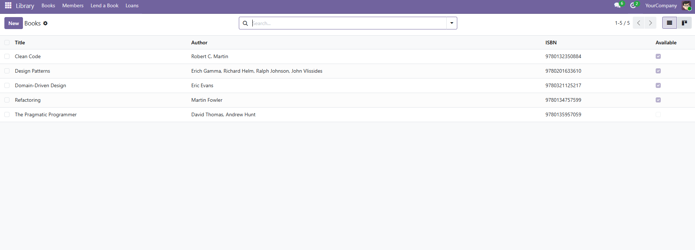
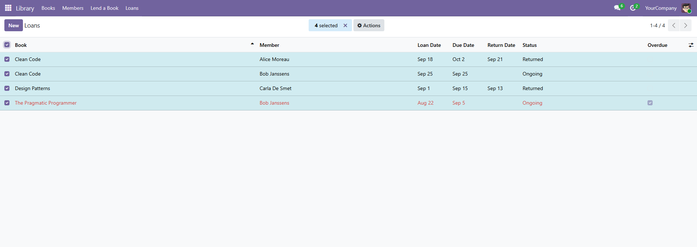
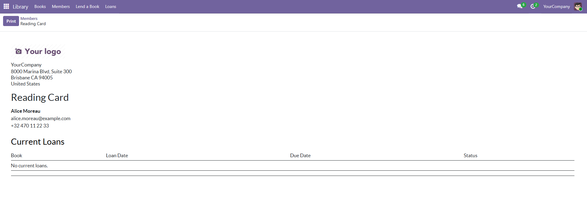

# Library — Odoo training module

[](https://github.com/AndrewUl22/library/actions/workflows/tests.yml)

A custom Odoo 19 module for managing a small library: books, members, and
loans, with role-based access, a guided lending workflow, and a printable
member report.

## About the project

Built from scratch as a training project to learn Odoo module development —
models, ORM relations, security, views, reports, and tests — ahead of
applying for a Back-end Developer position at Odoo.

## Features

- **Books, Members, Loans** — three related models (`library.book`,
  `library.member`, `library.loan`) linked with One2many/Many2one relations
- **`library.member` delegates to `res.partner`** via `_inherits` (same
  pattern Odoo itself uses for `res.users`), so members reuse the standard
  contact fields (name, email, phone)
- **"Lend a Book" wizard** — a `TransientModel` that walks through picking a
  book, a member, and a due date before creating the actual loan record
- **Availability tracking** — a computed field marks a book unavailable
  while it's on loan
- **Overdue tracking** — a computed `is_overdue` field on each loan
- **Role-based access** — two security groups (`Library / User`,
  `Library / Librarian`) with record rules: a regular member only sees their
  own loan history, a librarian sees everyone's
- **Kanban view** for browsing the book catalog
- **PDF "Reading Card" report** — per-member printable report listing their
  current loans
- **Demo data** — 5 books, 3 members, and loans in different states
  (ongoing, returned, overdue) to explore the module immediately
- **Unit tests** covering the availability constraint, `is_overdue`, the
  lending wizard, and the member record rule
- **CI** — GitHub Actions runs the test suite (via the official `odoo:19`
  Docker image) on every push

## Screenshots

**Books catalog**



**Lend a Book wizard**


**Loans overview**



**Reading Card report**



## Tech Stack

- Odoo 19 (Python, ORM)
- PostgreSQL
- QWeb (views and PDF report)
- Owl / XML views (form, list, kanban, search)

## Getting Started

### Prerequisites

- Odoo 19 source (`odoo-bin`) and its Python virtualenv
- PostgreSQL

### Installation

Clone this repo into your Odoo `addons-path`, then:

```bash
odoo-bin -d mydb --addons-path=addons,odoo/addons -i library --with-demo=all
```

> Odoo 19 only loads demo data on a fresh install (`-i`), not on an update
> (`-u`) of an already-installed module, and demo data now requires
> `--with-demo` to be passed explicitly.

Open `http://localhost:8069`, select your database, and look for **Library**
in the Apps menu.

### Running tests

```bash
odoo-bin -d test_db --addons-path=addons,odoo/addons -u library --test-enable --test-tags /library --stop-after-init
```

## CI

Tests run automatically on every push via GitHub Actions, using the official
`odoo:19` Docker image against a PostgreSQL service container. See
[`.github/workflows/tests.yml`](.github/workflows/tests.yml).

## License

This project is licensed under the MIT License.
